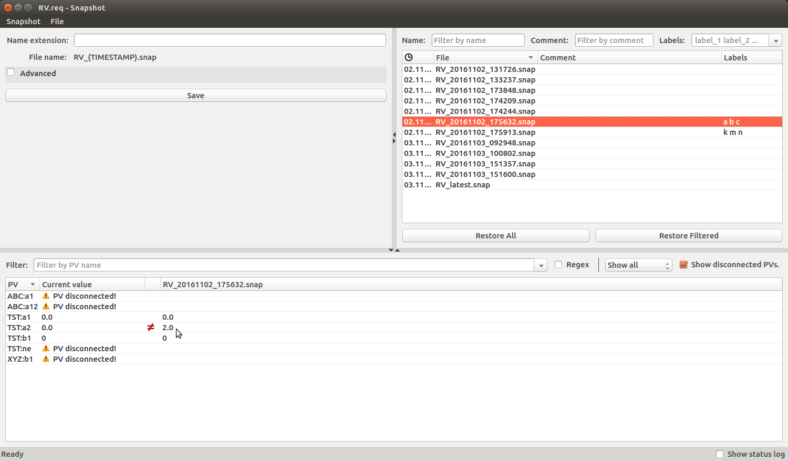

# Overview
Snapshot is Python based tool with a graphical user interface which is able to store (and later restore) values of Channel Access process variables (PVs).



# Installation

Snapshot is available as an Anaconda package on the paulscherrerinstitute Anaconda package channel. It can be easily installed as follows:

```bash
conda install -c https://conda.anaconda.org/paulscherrerinstitute snapshot
```

# Usage
To define a set of PVs which should be saved/restored the _snapshot_ tool requires a "request" file. Request files are in the following format. Beside accepting explicit channels also the use of macros are possible. From version 1.5.0 on, request files format was extended to support nested loading of request files.

```
examplePv:test-1
examplePv:test-2
$(SYS):test-3

# Loading other request files with different macro values
!./relative/path/file1.req, "SYS=$(SYS),ID=1"
!./relative/path/file1.req, "SYS=$(SYS),ID=2"

# Also from absolute path
!/absolute/path/file2.req, "SYS=$(SYS),ID=1"
```

After snapshot is build and deployed as conda package (see section [Instalation](#installation) it can be used in graphical mode or as command line tool.

To use graphical interface snapshot must be started with following command:

```bash
snapshot [-h] [-m MACRO] [-d DIR] [-b BASE] [-f] [--labels LABELS] [--force_labels] [--config CONFIG] [FILE]

Longer version of same command:
snapshot gui [-h] [-m MACRO] [-d DIR] [-b BASE] [-f] [--labels LABELS] [--force_labels] [--config CONFIG] [FILE]

positional arguments:
  FILE                  request file.

  -h, --help            show this help message and exit
  -m MACRO, --macro MACRO
                        macros for request file e.g.: "SYS=TEST,DEV=D1"
  -d DIR, --dir DIR     directory for saved snapshot files
  -b BASE, --base BASE  base directory for request files
  -f, --force           force save/restore in case of disconnected PVs
  --labels LABELS       list of comma separated predefined labels e.g.:
                        "label_1,label_2"
  --force_labels        force predefined labels
  --config CONFIG       path to configuration file
```

> Configuration file enables option of predefined labels and filters. Example can be found in [HERE](example/config.cfg)

To be used as command line tool it must be run either with `snapshot save` or `snapshot restore` depending on action needed.

```bash
snapshot save [-h] [-m MACRO] [-o OUT] [-f] [--timeout TIMEOUT] FILE

positional arguments:
  FILE                  request file

optional arguments:
  -h, --help            show this help message and exit
  -m MACRO, --macro MACRO
                        macros for request file e.g.: "SYS=TEST,DEV=D1"
  -o OUT, --out OUT     Output path/file.
  -f, --force           force save in case of disconnected PVs after timeout
  --timeout TIMEOUT     max time waiting for PVs to be connected
```

```bash
snapshot restore [-h] [-f] [--timeout TIMEOUT] FILE

positional arguments:
  FILE               saved snapshot file

optional arguments:
  -h, --help         show this help message and exit
  -f, --force        force restore in case of disconnected PVs after timeout
  --timeout TIMEOUT  max time waiting for PVs to be connected and restored
```

## Format of saved files
When PVs values are saved using a GUI, they are stored in file where first line starts with `#` and is followed by meta data (json formating). This is followed by lines with PV names and saved data (one line per PV). Example:

```
#{"keywords": "key1,key2", "comment": "This is comment", "save_time": 1452670573.6637778}
examplePv:test-1,20
examplePv:test-2,30
examplePv:test-3,"string"
examplePv:test-4,[5.0, 6.0, 7.0, 8.0, 9.0, 0.0, 1.0, 2.0, 3.0, 4.0]
```

# Development
## Dependencies
_Snapshot_ has following dependencies:
 - Python 3
 - pyepics
 - pyqt
 - numpy
